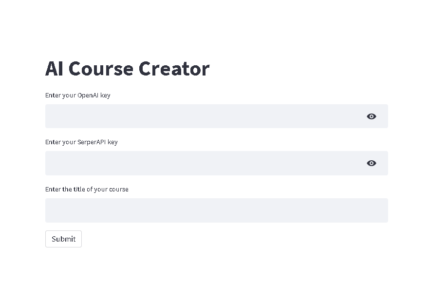

# AI-Course-Creator
Create your own AI course on any topic in seconds

# Setup 
Enter your OpenAI key and SerpAPI key and topic. Click on submit button. Boom! Your course is created

# Digestive System

The digestive system is a group of organs that work together to break down the food we eat into smaller molecules that can be absorbed into the bloodstream and used as energy or building blocks for the body.

## Mouth
The digestive process begins in the mouth, where teeth break down the food into smaller pieces and saliva helps to moisten and soften it.

## Stomach
The food then enters the stomach, where it is mixed with stomach acid and digestive enzymes that further break it down into a liquid called chyme. 

$formula: HCl + pepsinogen \to HCl + pepsin$

## Small Intestine
The chyme then enters the small intestine, where it is mixed with bile from the liver and enzymes from the pancreas to further break down the molecules. The walls of the small intestine are lined with tiny finger-like projections called villi, which absorb the nutrients into the bloodstream to be used by the body.

## Large Intestine
The remaining waste products then enter the large intestine, where water is absorbed and the waste is formed into feces to be eliminated from the body.

## Liver and Pancreas
The liver and pancreas are important accessory organs of the digestive system. The liver produces bile, which helps to break down fats in the small intestine. The pancreas produces enzymes that help to break down carbohydrates, fats, and proteins.

# Conclusion
The digestive system plays a crucial role in providing the body with the nutrients it needs to function properly. A healthy diet and good digestive health are essential for overall well-being.

# Comprehension
Que1 - What is the role of teeth in the digestive system?

Ans - The teeth break down the food into smaller pieces.

Que2 - What is chyme?

Ans - Chyme is a liquid formed in the stomach by mixing food with stomach acid and digestive enzymes.

Que3 - What is the role of villi in the small intestine?

Ans - Villi absorb the nutrients from the food into the bloodstream.

Que4 - What is the function of the liver and pancreas in the digestive system?

Ans - The liver produces bile, which helps to break down fats, and the pancreas produces enzymes that help to break down carbohydrates, fats, and proteins.

Que5 - What happens in the large intestine?

Ans - Water is absorbed and waste products are formed into feces to be eliminated from the body.

